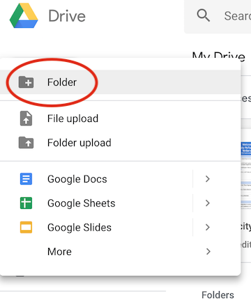
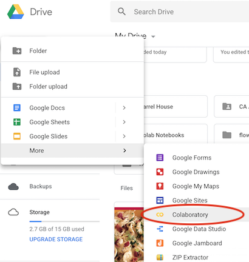

# Setting up Google Colab

## Setting up your drive

1. Create a folder for your notebooks 

Go to your Google Drive, and select "New" > "Folder". 

Set the folder name as: "intro-to-python". 

Copy in the files provided by the instructor. 

2. Create new google colab notebook

To create a new notebook from scratch, go to your Google Drive, and select "New" > "More" > "Colaboratory". 

3. Open an existing google colab notebook 

To open an existing notebook, double click on an existing notebook (.ipynb). 
